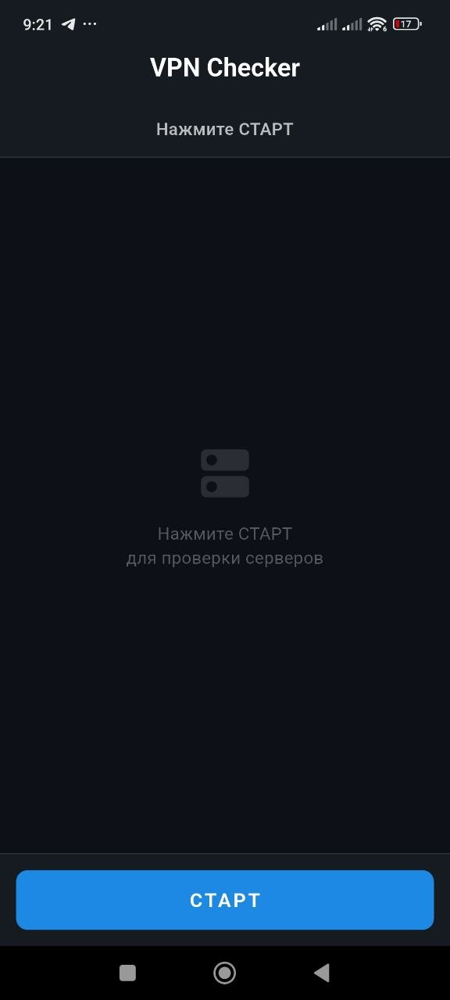
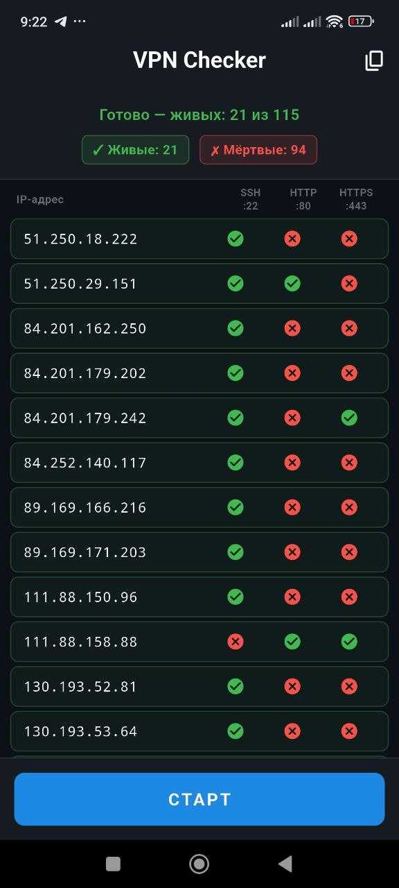

# 🔍 VPN Checker

**Проверка доступности VPN-серверов по портам 22, 80, 443**


[](https://github.com/550953/vpn-checker-flutter/releases/latest)

---

**🇷🇺 Русский** · [🇬🇧 English](#en)

---

<a name="ru"></a>
## 🇷🇺 Русский

**[Скачать APK](https://github.com/550953/vpn-checker-flutter/releases/latest)** · **[Быстрый старт](#quick-start-ru)**

### Что это?

VPN Checker — мобильное приложение для проверки доступности VPN-серверов. Сканирует IP-адреса из облачного списка и проверяет открытые порты:

| Порт | Протокол | Назначение |
|------|----------|------------|
| **22** | SSH | Доступ по ключу |
| **80** | HTTP | Веб-сервер |
| **443** | HTTPS | Безопасный веб-сервер |

### Как это работает

```
Загрузка списка IP → Проверка портов (22, 80, 443) → Отображение живых серверов → Копирование списка
```

### Скриншоты

| Стартовый экран | Результат проверки |
|---|---|
|  |  |

<a name="quick-start-ru"></a>
### Быстрый старт

1. Скачать APK из [Releases](https://github.com/550953/vpn-checker-flutter/releases/latest)
2. Разрешить установку из неизвестных источников
3. Установить и запустить
4. Нажать **СТАРТ**

### Особенности

- ⚡ Быстрая проверка (до 100 IP за 30 секунд)
- 🎯 Проверка трёх портов: 22, 80, 443
- 📋 Копирование списка живых IP
- 🎨 Тёмная тема (как в GitHub)
- 📊 Прогресс и статус каждой проверки
- 🔄 Многопоточная проверка (до 10 IP одновременно)

### Источник IP-адресов

```
https://storage.yandexcloud.net/vpn-ips/ip.txt
```

Вы можете использовать свой список, изменив URL в коде.

### Технологии

| Компонент | Технология |
|---|---|
| Фреймворк | Flutter |
| Язык | Dart |
| Сетевые запросы | HTTP + TCP Sockets |
| Многопоточность | `Future.wait` |
| Минимальная версия Android | 5.0 (API 21) |
| iOS | 11.0 |

### Установка на iOS

Для установки на iPhone потребуется AltStore или SideStore (бесплатно, переподпись каждые 7 дней).


---

<a name="en"></a>
## 🇬🇧 English

**[Download APK](https://github.com/550953/vpn-checker-flutter/releases/latest)** · **[Quick Start](#quick-start-en)**

### What is this?

VPN Checker is a mobile app that scans IP addresses from a cloud list and checks for open ports 22 (SSH), 80 (HTTP), and 443 (HTTPS). Perfect for VPN server monitoring.

### Screenshots

| Start screen | Result screen |
|---|---|
|  |  |

### Features

- ⚡ Fast scanning (up to 100 IPs in 30 seconds)
- 🎯 Checks ports: 22, 80, 443
- 📋 Copy list of alive IPs with one tap
- 🎨 Dark theme
- 📊 Progress and status for each check
- 🔄 Multi-threaded scanning

<a name="quick-start-en"></a>
### Quick Start

1. Download APK from [Releases](https://github.com/550953/vpn-checker-flutter/releases/latest)
2. Allow installation from unknown sources
3. Install and launch
4. Tap **START**

### License

MIT © 2026 Nikolay Shikin

---

## Author

**Nikolay Shikin** — freelance developer & designer  
🌐 [shikinn.com](https://shikinn.com)  
💼 [freelance.ru/guru_sun](https://freelance.ru/guru_sun)  
🐙 [github.com/550953](https://github.com/550953)
